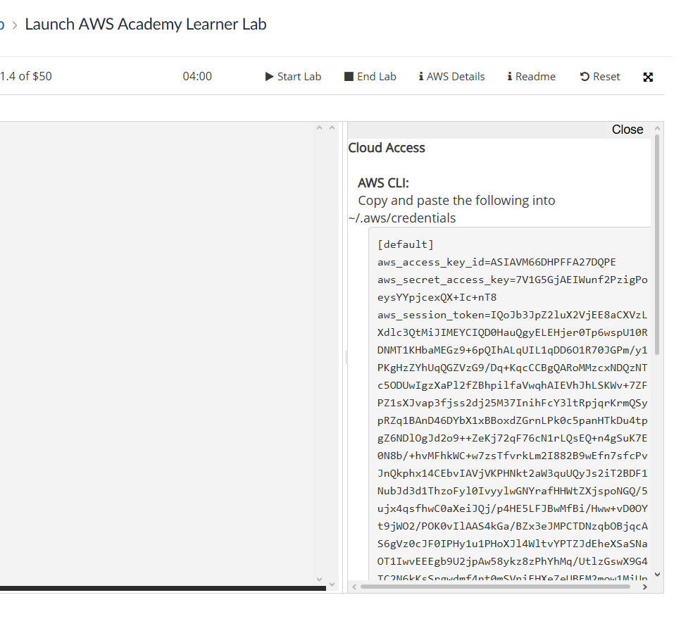
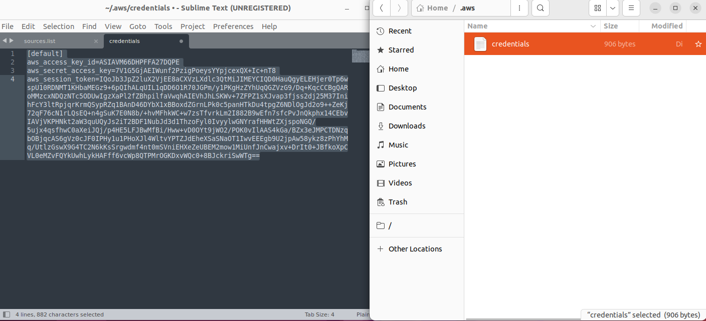
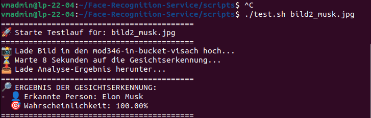

#!/bin/bash
# Autor: Ganzes Team
# Datum: 29.03
# Beschreibung: Setup für AWS Learner-Lab (us-east-1)

# Dokumentation: AWS Face Recognition Setup & Test

Diese Dokumentation beschreibt den vollständigen Ablauf zur Einrichtung und zum Testen einer serverlosen Gesichtserkennung (AWS Rekognition) mithilfe von AWS Learner-Lab, S3-Buckets und AWS Lambda.

## Phase 1: Vorbereitung der Umgebung

### Schritt 1: Virtuelle Maschine starten

Um mit dem Setup zu beginnen, muss die lokale Entwicklungsumgebung gestartet werden.

1. VMware (oder die entsprechende VM-Software) öffnen und die Linux-VM starten.
2. Das Terminal öffnen.

### Schritt 2: AWS Credentials einrichten

Damit die Skripte mit AWS kommunizieren können, müssen die temporären Zugangsdaten aus dem AWS Learner-Lab hinterlegt werden.

1. Im AWS Learner-Lab auf "AWS Details" klicken und die CLI-Credentials kopieren.
2. Die Credentials im Terminal in der Datei `~/.aws/credentials` speichern oder direkt als Umgebungsvariablen in die Session kopieren.

## Phase 2: Infrastruktur aufbauen (Setup-Skript)

Das erste Skript (`setup.sh`) baut die komplette AWS-Infrastruktur vollautomatisch auf.

### Schritt 3: Grundkonfiguration & S3 Buckets erstellen

Das Skript erzwingt zunächst die Region `us-east-1` (Pflicht im Learner-Lab). Danach werden zwei S3-Buckets erstellt:

*   **In-Bucket** (`mod346-in-bucket-visach`): Hier laden wir später die Fotos hoch.
*   **Out-Bucket** (`mod346-out-bucket-visach`): Hier speichert die Lambda-Funktion die Ergebnisse der Gesichtserkennung als JSON-Datei ab.

### Schritt 4: Lambda-Code verpacken

Das Skript wechselt in den Quellcode-Ordner (`../src`) und verpackt den Python-Code (`lambda_function.py`) in eine ZIP-Datei, da AWS Lambda den Code in diesem Format benötigt.

### Schritt 5: Lambda-Funktion erstellen & Berechtigungen setzen

Das Skript erstellt die Lambda-Funktion (`mod346-face-rekognition-visach`) mit Python 3.12. Dabei passiert Folgendes:

*   Der zuvor verpackte Code wird hochgeladen.
*   Die Funktion bekommt die `LabRole` zugewiesen (damit sie überhaupt Rechte in AWS hat).
*   Die Umgebungsvariable `OUTPUT_BUCKET` wird gesetzt, damit Lambda weiß, wo die Ergebnisse gespeichert werden sollen.

### Schritt 6: S3-Trigger einrichten (Verknüpfung)

Damit Lambda automatisch startet, sobald ein Bild hochgeladen wird, richtet das Skript einen "Trigger" ein.

*   Es wird eine Berechtigung hinzugefügt, dass S3 die Lambda-Funktion aufrufen darf.
*   Eine `notification.json` wird an den In-Bucket gehängt. Die Regel lautet: Sobald ein Objekt erstellt wird (`s3:ObjectCreated:*`), starte die Lambda-Funktion!

## Phase 3: Ausführung und Test (Test-Skript)

Das zweite Skript (`test.sh`) übernimmt den Upload des Bildes und wertet die JSON-Antwort für den Benutzer aus.

### Schritt 7: Skript-Aufruf & Bild-Upload

Das Skript wird im Terminal aufgerufen und ein Bild wird als Parameter übergeben (z. B. `./test.sh obama.jpg`).

1. Das Skript prüft, ob ein Bild angegeben wurde.
2. Es lädt das Bild in den In-Bucket hoch.

**Hintergrund:** Dieser Upload triggert jetzt automatisch die in Phase 2 erstellte Lambda-Funktion, welche wiederum AWS Rekognition anfunkt.

### Schritt 8: Warten & JSON-Ergebnis herunterladen

Das Skript pausiert für 8 Sekunden. Diese Zeit braucht AWS, um das Bild zu analysieren und die Ergebnis-JSON in den Out-Bucket zu legen.

Nach der Wartezeit lädt das Skript die Datei `bildname.jpg.json` aus dem Out-Bucket herunter.

 
### Schritt 9: Auswertung & Ausgabe der Ergebnisse

Das Skript liest die heruntergeladene JSON-Datei mithilfe eines kurzen Python-Befehls aus (Gütestufe 3 Anforderung).

*   Es sucht nach dem Key `CelebrityFaces`.
*   Wird eine berühmte Person erkannt, gibt das Terminal den Namen und die Wahrscheinlichkeit (`MatchConfidence`) in Prozent aus.
*   Wird niemand erkannt, gibt es eine entsprechende Meldung.
*   Zuletzt räumt das Skript auf und löscht die lokale JSON-Datei wieder.
