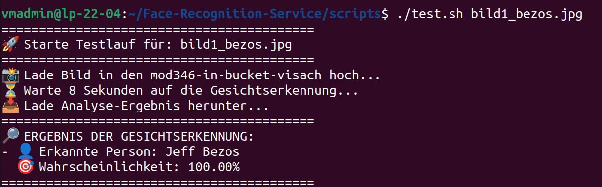
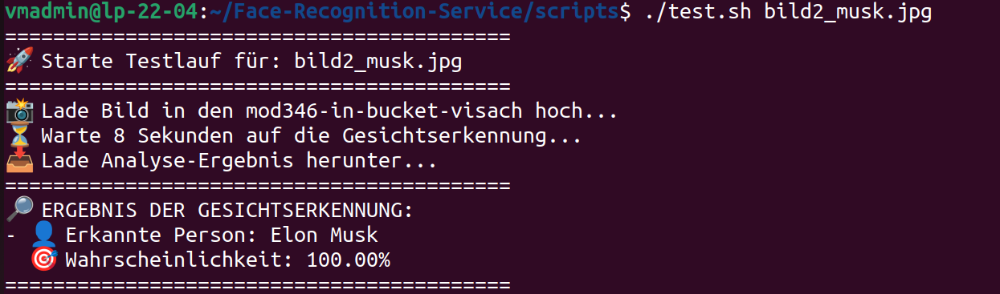
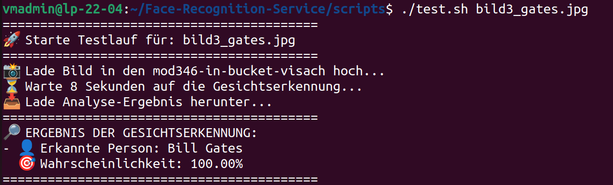

# 🧪 Testprotokolle: Face Recognition Service
 
**Allgemeine Testinformationen:**
* **Testdatum:** 24. März 2026
* **Testperson:** [Name von Kollege 2 eintragen]
* **Testumgebung:** AWS Learner-Lab (us-east-1), Ausführung via Linux-VM (Ubuntu 22.04)
 
---
 
## Testfall 1: Erkennung einer bekannten Persönlichkeit (Jeff Bezos)
* **Beschreibung:** Ein Bild von Jeff Bezos wird in den S3 In-Bucket hochgeladen.
* **Erwartetes Ergebnis:** Das System erkennt die Person als "Jeff Bezos" mit einer hohen Wahrscheinlichkeit (>90%).
* **Tatsächliches Ergebnis:** Erfolgreich. Die AWS Rekognition API hat Jeff Bezos erkannt.
* **Beweis-Screenshot:**
  
* **Fazit:** Die Kernfunktionalität (Erkennung und JSON-Generierung) funktioniert fehlerfrei und vollautomatisiert.
 
---
 
## Testfall 2: Erkennung einer bekannten Persönlichkeit (Elon Musk)
* **Beschreibung:** Ein Bild von Elon Musk wird in den S3 In-Bucket hochgeladen.
* **Erwartetes Ergebnis:** Das System erkennt die Person als "Elon Musk" mit einer hohen Wahrscheinlichkeit (>90%).
* **Tatsächliches Ergebnis:** Erfolgreich. Die AWS Rekognition API hat Elon Musk erkannt.
* **Beweis-Screenshot:**
  
* **Fazit:** Die Kernfunktionalität (Erkennung und JSON-Generierung) funktioniert fehlerfrei und vollautomatisiert.
 
---

---
 
## Testfall 3: Erkennung einer bekannten Persönlichkeit (Bill Gates)
* **Beschreibung:** Ein Bild von Bill Gates wird in den S3 In-Bucket hochgeladen.
* **Erwartetes Ergebnis:** Das System erkennt die Person als "Bill Gates" mit einer hohen Wahrscheinlichkeit (>90%).
* **Tatsächliches Ergebnis:** Erfolgreich. Die AWS Rekognition API hat Bill Gates erkannt.
* **Beweis-Screenshot:**
  
* **Fazit:** Die Kernfunktionalität (Erkennung und JSON-Generierung) funktioniert fehlerfrei und vollautomatisiert.
 
---

## Testfall 2: Negativ-Test mit einem Tier (Hund)
* **Beschreibung:** Ein Bild eines Hundes wird in den S3 In-Bucket hochgeladen, um zu prüfen, ob das System falsche Treffer liefert oder abstürzt.
* **Erwartetes Ergebnis:** Das System stürzt nicht ab, sondern meldet sauber, dass keine bekannte Persönlichkeit erkannt wurde.
* **Tatsächliches Ergebnis:** Erfolgreich. Das Skript gab die Meldung "Keine bekannte Persönlichkeit auf diesem Foto erkannt" aus.
* **Beweis-Screenshot:**
  
* **Fazit:** Die Fehlerabfang-Logik (`try-except` und JSON-Parsing im Test-Skript) ist robust und stürzt bei ungültigen Motiven nicht ab. Empfehlung: Keine weiteren Massnahmen nötig.
 
---
